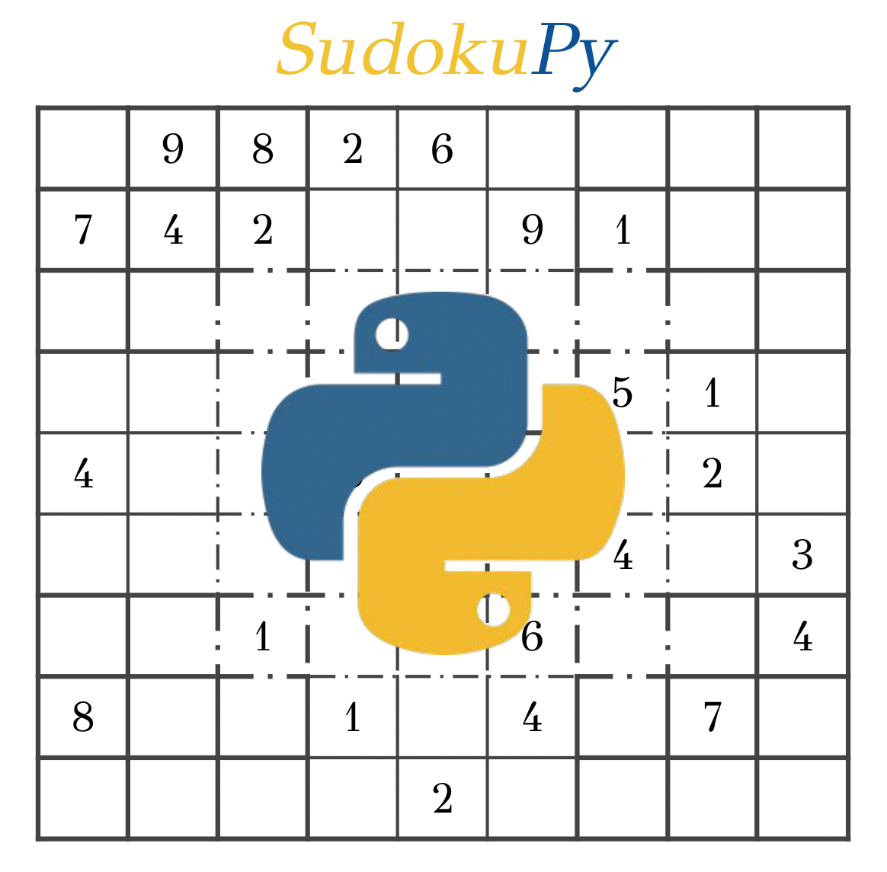
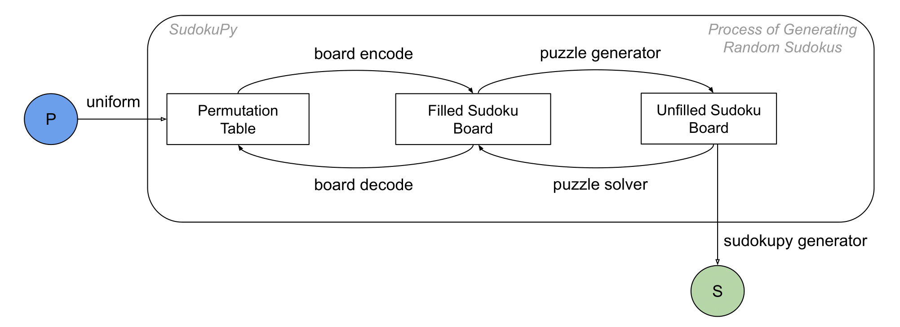

<div align="center">
<h1>SudokuPy: Sudoku Generator</h1>

**Panagiotis Giannoulis<sup>1</sup>, Yorgos Pantis<sup>2,3</sup>, Christos Tzamos<sup>2,3</sup>**

<sup>1</sup>National Technical University of Athens, Greece<br>
<sup>2</sup>National and Kapodistrian University of Athens, Greece<br>
<sup>3</sup>Archimedes, Athena Research Center, Athens, Greece<br>

[](https://papers.nips.cc/paper_files/paper/2025/hash/yourpaperid-Abstract.html)
[](https://opensource.org/licenses/MIT)

</div>

<div align="center">
  
</div>

## Overview
Many machine learning studies rely on pre-existing datasets, however in combinatorial problems like Sudoku, efficiently generating truly random puzzles is crucial. *SudokuPy* addresses this by providing a fast Python-based generator (written in C) that systematically constructs valid Sudoku boards while ensuring uniqueness. This dual-language implementation ensures fast Sudoku generation making it ideal for large-scale dataset creation and AI live-streaming training. 

## Installation  

*SudokuPy* will be available on PyPI soon.  
Until then, you can install it directly from GitHub:  

```bash
pip install git+https://github.com/gpt-reasoning/sudokupy.git
```

## Citation
This work was part of the NeurIPS'25 paper *Teaching Transformers to Solve Combinatorial Problems through Efficient Trial \& Error* (see the [repository](https://github.com/yorgospantis/ReasoningCombinatorials)). 
If you use this work, please cite it as follows:
```bibtex
@inproceedings{giannoulis2025teaching, 
  title={Teaching Transformers to Solve Combinatorial Problems through Efficient Trial & Error}, 
  author={Giannoulis, Panagiotis and Pantis, Yorgos and Tzamos, Christos}, 
  booktitle={The Thirty-ninth Annual Conference on Neural Information Processing Systems}, 
  year={2025}
}
```

## Project Structure
```
SudokuPy/
│
├── python_code/
│   ├── __init__.py                 # Package initialization
│   ├── puzzle_generator.py         # Generates candidate boards for validation
│   ├── puzzle_solver.py            # Python interface for C-based solver
│   └── sudokupy_gen.py             # Black-box generator for puzzles and its solutions
│
├── c_code/
│   ├── jczsolver.c                 # C code to check unique solvability
│   ├── libsolver.so                # Shared library (Linux/macOS)
│   ├── libsolver.dll               # Shared library (Windows)
│
├── example/
│   └── example.ipynb               # Usage examples
│
├── data/
│   └── sudoku_processed.csv.gz     # Permutation tables for encoding/decoding
│
├── figure/
│   └── sudokupy.png                # Diagram of SudokuPy workflow
│
├── tests/
│   └── test.py                     # Unit tests
│
├── setup.py                        # Packaging script
├── README.md                       # Project documentation
├── MANIFEST.in                     # Non-Python file manifest
├── requirements.txt                # Dependencies
└── LICENSE                         # License file
```

## License

This project is released under the MIT License.

---

## Workflow


*SudokuPy* works as follows:

Out of the `6,670,903,752,021,072,936,960` distinct valid Sudoku boards, it selects one uniformly at random and removes entries using a uniformly random permutation of the 81 cells. An entry is only removed if its absence still yields a uniquely solvable puzzle.

As the figure above shows, the input to our main generator is the number `P`, specifying how many puzzles to generate (highlighted in blue). The output is a set of generated puzzles (highlighted in green). Optional features like difficulty rating and solution path visualization are shown in orange.

The process begins with generating a random integer in the range \[`1, 6,670,903,752,021,072,936,960`\], corresponding to all valid Sudoku solutions. This number is mapped to a complete board using `board_encode` and `board_decode`, leveraging precomputed permutation tables. The puzzle is then formed by gradually removing numbers using `puzzle_generator`, and ensuring uniqueness at each step via `puzzle_solver`. These are C-based routines exposed through Python. For convenience, a black-box function named `sudokupy_generator` is provided, which returns multiple puzzles and their solutions with a single call.

## Third-Party Contributions and Acknowledgments
This project includes components based on earlier works by:

- **`puzzle_solver`** (originally named `JCZSolve`): Implemented by users *zhouyundong_2012*, *champagne*, and *JasonLion*, and posted on the [Sudoku Forum](http://forum.enjoysudoku.com/3-77us-solver-2-8g-cpu-testcase-17sodoku-t30470.html) without a specified license.

> **Note:** If you are one of the contributors of the above solver and would like changes to this attribution, please contact us.